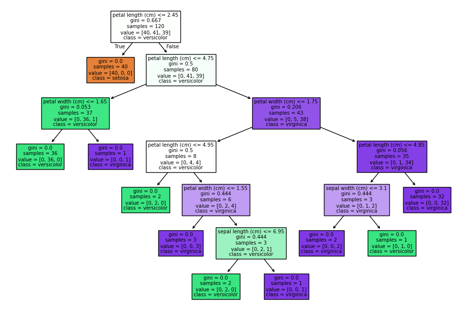

1. Decision Tree Implementation

This project is part of my CODTECH internship task.

The objective of this task is to build and visualize a Decision Tree model using Scikit-learn for classification.

2. Dataset

For this task, the Iris dataset from sklearn was used.  
It contains measurements of iris flowers such as sepal length, sepal width, petal length and petal width.  
The model predicts the species of the flower.

3. Steps Performed

- Loaded the Iris dataset
- Split the dataset into training and testing data
- Trained a Decision Tree Classifier
- Predicted results on test data
- Calculated accuracy
- Visualized the decision tree structure

4. Output

The model successfully classified the iris flower species with good accuracy.  
The decision tree visualization helps in understanding how the model makes decisions based on feature values.

5. Observations

- Decision trees are easy to understand and interpret.
- Visualization clearly shows how features are used to split the data.
- The model performed well on the dataset with good accuracy.

6. Tools Used

- Python
- Scikit-learn
- Pandas
- Matplotlib
- Jupyter Notebook
7. Visualization

Below is the visualization of the trained Decision Tree model.

