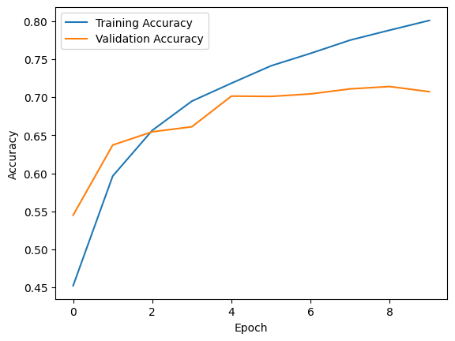

Image Classification using CNN

This project is part of my CODTECH internship tasks.

The objective of this task is to build an image classification model using a Convolutional Neural Network (CNN). The model is trained on the CIFAR-10 dataset using TensorFlow.

Dataset

The CIFAR-10 dataset contains 60,000 images belonging to 10 different classes such as airplane, automobile, bird, cat, deer, dog, frog, horse, ship and truck.

Each image has a resolution of 32x32 pixels with RGB color channels.

Steps Performed

- Loaded the CIFAR-10 dataset
- Normalized image pixel values
- Visualized sample images
- Built a CNN model using convolution and pooling layers
- Trained the model on training data
- Evaluated model performance on the test dataset

Output

The CNN model successfully classified images into their respective categories.  
The model achieved good accuracy on the test dataset.

 Observations

- CNN models are highly effective for image classification tasks.
- Convolution layers extract important visual features from images.
- Pooling layers help reduce dimensionality and improve efficiency.

 Tools Used

- Python
- TensorFlow / Keras
- Matplotlib
- Jupyter Notebook

Visualization

Below is the visualization of the trained Decision Tree model.

