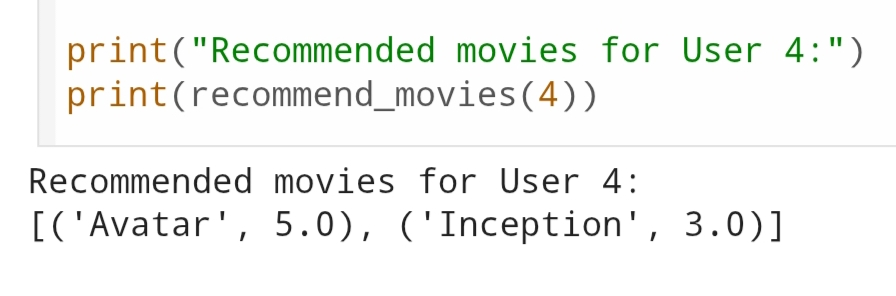

Recommendation System

This project is part of my CODTECH internship tasks.

The objective of this task is to build a recommendation system using collaborative filtering techniques to suggest items to users based on their preferences.

Dataset

A sample movie ratings dataset was used where users provide ratings for different movies. The system uses these ratings to recommend movies to similar users.

 Steps Performed

- Created a user-movie rating dataset
- Converted data into a user-item matrix
- Calculated similarity between users using cosine similarity
- Identified similar users
- Recommended movies based on similar users' preferences

 Output

The recommendation system successfully suggested movies for users based on the preferences of similar users.

 Observations

- Collaborative filtering works by identifying similar user behavior.
- Cosine similarity helps measure similarity between user rating patterns.
- The system can recommend items even without explicit item features.

Tools Used

- Python
- Pandas
- Scikit-learn
- Jupyter Notebook

OUTPUT

Below is the OUTPUT of the RECOMMENDATION SYSTEM

